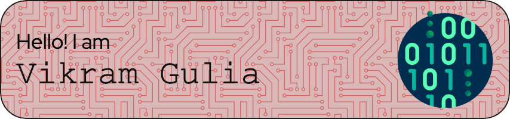

> "Code is like humor. When you have to explain it, it’s bad." – Cory House

### About Me

I'm a Software Engineer by day, and a cool dad by night. I love turning coffee into code, and sometimes it even works!

- 🌍 I'm based in Parker, CO.
- 💻 I'm currently working with Sinch Voice.
- 🎯 Goals: Build Better Things.
- ⚡ Fun fact: Running is my therapy!

### 🛠️ Languages and Tools

### 📊 GitHub Stats

### 🏆 Top Languages

### 📫 How to reach me

- LinkedIn: [@vikramgulia](https://www.linkedin.com/in/vikramgulia/)
- Email: [me@vikramgulia.com](mailto:me@vikramgulia.com)

### 😂 Random Dev Joke

> Why do programmers prefer dark mode? Because light attracts bugs!

<!---
guliasinch/guliasinch is a ✨ special ✨ repository because its `README.md` (this file) appears on your GitHub profile.
You can click the Preview link to take a look at your changes.
--->
